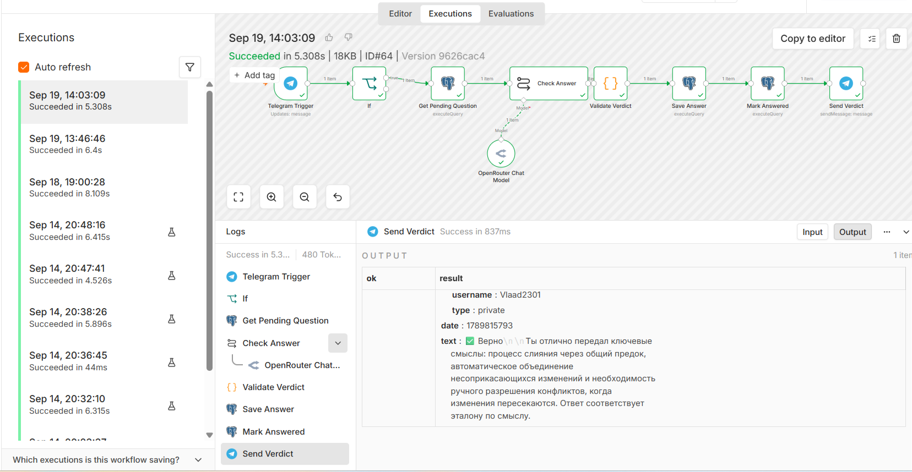
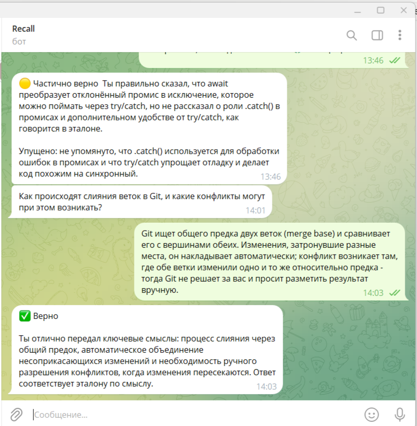
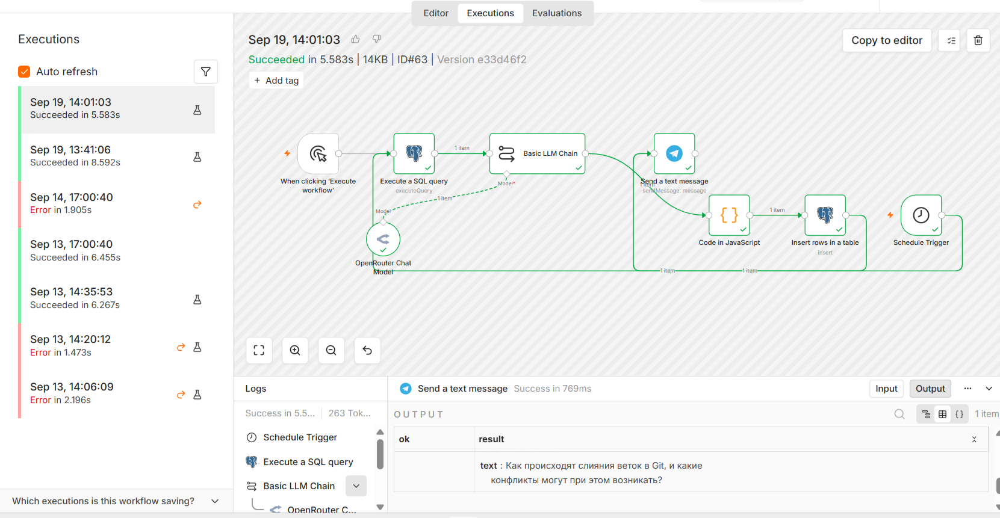

# Recall

Telegram-бот для проверки знаний с автоматической оценкой свободного ответа через LLM.

Инструмент проверки усвоения материала по заданному набору тем. Пользователь получает вопрос, отвечает своими словами, система сверяет ответ с эталоном и выдаёт разбор. Результаты накапливаются в базе и служат основой для адаптивной выдачи следующих вопросов.

Применимо к онбордингу сотрудников, корпоративному обучению, контролю знания регламентов и внутренней документации. Набор тем — параметр конфигурации, а не часть логики: в демо-наборе используются основы бэкенда (SQL и индексы, Row Level Security, миграции, async/await, обработка ошибок, TypeScript, REST, вебхуки, переменные окружения, Docker, Git).

Реализовано на n8n в self-hosted режиме.

## Механика

1. По расписанию LLM генерирует вопрос по случайной активной теме. Вопрос и эталонный ответ сохраняются в базу со статусом `pending`, вопрос отправляется в Telegram.
2. Пользователь отвечает свободным текстом.
3. Входящее сообщение проходит фильтр: наличие текста, не команда, минимальная длина.
4. LLM сверяет ответ с эталоном и возвращает строгий JSON: вердикт (`correct` / `partial` / `incorrect`), что упущено, пояснение.
5. Ответ модели валидируется: снимается markdown-обёртка, проверяется структура и допустимость вердикта.
6. Результат пишется в базу, вопрос переводится в статус `answered`, разбор отправляется пользователю.
7. Любая необработанная ошибка в цепочке перехватывается отдельным error-workflow и уходит уведомлением в Telegram.

## Архитектура

Три воркфлоу.

### `recall-question-delivery` — выдача вопроса

```
Manual Trigger ┐
               ├→ Postgres (выбор темы) → Basic LLM Chain → Code (парсинг + валидация) → Postgres (запись) → Telegram
Schedule 9:00  ┘
```

| Нода | Назначение |
|---|---|
| Schedule Trigger | запуск по расписанию, ежедневно в 9:00 |
| Manual Trigger | ручной запуск для отладки и внеочередной генерации |
| Postgres | выбор активной темы из `topics` |
| Basic LLM Chain | генерация вопроса и эталонного ответа по теме, вывод в JSON |
| Code | снятие markdown-обёртки, парсинг, проверка обязательных полей |
| Postgres | запись вопроса в `questions` со статусом `pending` |
| Telegram | отправка вопроса пользователю |

### `recall-answer-check` — проверка ответа

```
Telegram Trigger → IF (фильтр)
                     ├─ false → выход без обработки
                     └─ true  → Postgres (поиск вопроса) → Basic LLM Chain (сверка)
                                → Code (валидация) → Postgres (запись в answers)
                                → Postgres (смена статуса) → Telegram (разбор)
```

| Нода | Назначение |
|---|---|
| Telegram Trigger | приём входящего сообщения по вебхуку |
| IF | отсечение команд, нетекстовых сообщений и реплик короче 15 символов |
| Postgres | поиск последнего вопроса со статусом `pending` |
| Basic LLM Chain | сверка ответа пользователя с эталоном, вывод в JSON |
| Code | валидация структуры ответа модели и допустимости вердикта |
| Postgres | запись результата в `answers` через параметризованный запрос |
| Postgres | перевод вопроса в статус `answered` |
| Telegram | отправка разбора пользователю |

Ветка `false` намеренно не подключена: на сообщения, не являющиеся ответом, бот не реагирует.

### `recall-error-handler` — обработка сбоев

```
Error Trigger → Telegram
```

Назначен обработчиком ошибок для обоих основных воркфлоу. Перехватывает любую необработанную ошибку и присылает уведомление с именем воркфлоу, именем упавшей ноды и текстом ошибки. Решает проблему тихих сбоев: без него отказ цепочки по расписанию остался бы незамеченным.

## Схема базы данных

Полный DDL — в файле [`schema.sql`](schema.sql).

**`topics`** — набор тем

| Поле | Тип | Назначение |
|---|---|---|
| `id` | bigint | первичный ключ |
| `name` | text | название темы, уникальное |
| `is_active` | boolean | участвует ли тема в выдаче, по умолчанию `true` |

**`questions`** — сгенерированные вопросы

| Поле | Тип | Назначение |
|---|---|---|
| `id` | bigint | первичный ключ |
| `topic_id` | bigint | внешний ключ на `topics` |
| `question_text` | text | текст вопроса |
| `reference_answer` | text | эталонный ответ для сверки |
| `status` | text | `pending` — отправлен, `answered` — обработан |
| `created_at` | timestamptz | время создания |

**`answers`** — результаты проверки

| Поле | Тип | Назначение |
|---|---|---|
| `id` | bigint | первичный ключ |
| `question_id` | bigint | внешний ключ на `questions` |
| `user_answer` | text | ответ пользователя |
| `verdict` | text | `correct` / `partial` / `incorrect` |
| `missed` | text | что упущено или искажено, может быть пустым |
| `explanation` | text | пояснение вердикта |
| `created_at` | timestamptz | время записи |

## Стек

- **n8n 2.34** (self-hosted, локальный запуск через npm)
- **PostgreSQL** (Supabase, подключение через session pooler)
- **OpenRouter** — доступ к LLM, модель `openai/gpt-4.1-mini`
- **Telegram Bot API**
- **cloudflared** (Docker) — туннель для приёма вебхуков на локальный инстанс

## Технические решения

**Строгий JSON на выходе LLM плюс валидация кодом.** Модель — ненадёжный источник: формат ответа не гарантирован, возможна markdown-обёртка, вольная трактовка допустимых значений. Граница между недетерминированной и детерминированной частью системы проходит по Code-ноде: она снимает обёртку, парсит JSON и отклоняет вердикт вне белого списка. Некорректный ответ модели приводит к явной ошибке, а не к молчаливой записи мусора в базу.

**Параметризованные запросы.** Данные из Telegram попадают в базу через плейсхолдеры (`$1`, `$2`), а не склейкой строк. Структура запроса и значения передаются раздельно, что исключает SQL-инъекции и поломку на кавычках внутри пользовательского текста.

**Фильтр на входе, а не на выходе.** Система не отличает неверный ответ от не-ответа: любое сообщение для неё — попытка ответить. Без фильтра реплика вроде «ок» записалась бы как `incorrect` и закрыла бы вопрос, испортив статистику по теме. Отсечение происходит до обращения к LLM и базе.

**Статусная модель вместо сортировки по дате.** Привязка ответа к вопросу идёт через статус `pending`, а не через «последний по времени». Это защищает от повторной обработки одного вопроса.

**Разделение ответственности между SQL и LLM.** Выбор вопроса делает запрос к базе, оценку — модель. Модель не имеет доступа к базе и не решает, на какой вопрос отвечал пользователь.

## Развёртывание

Требования: Node.js 20+, Docker, аккаунты Supabase, OpenRouter, бот через BotFather.

**1. База данных.** Выполнить [`schema.sql`](schema.sql) в SQL-редакторе Supabase. Скрипт создаёт три таблицы и заполняет `topics` демо-набором тем — набор можно заменить на свой.

**2. Установка n8n.**

```bash
npm install -g n8n
```

**3. Туннель.** Приём вебхуков от Telegram требует публичного адреса:

```bash
# терминал 1
docker run --rm cloudflare/cloudflared:latest tunnel --url http://host.docker.internal:5678
```

```powershell
# терминал 2 — адрес из вывода терминала 1
$env:WEBHOOK_URL="https://<адрес>.trycloudflare.com"
n8n start
```

**4. Воркфлоу.** Импортировать три JSON-файла из корня репозитория, создать креденшлы (Telegram, OpenRouter, Postgres), в настройках обоих основных воркфлоу указать `recall-error-handler` как Error Workflow, затем опубликовать.

Расписание и вебхуки работают только у опубликованных воркфлоу — сохранение создаёт черновик.

**5. Подстановка значений.** В `recall-error-handler` и `recall-question-delivery` заменить плейсхолдер `YOUR_CHAT_ID` на идентификатор целевого чата Telegram.

Токены и строки подключения хранятся в креденшлах n8n и в экспортированные воркфлоу не попадают.

## Известные ограничения

- **Временный адрес туннеля.** Quick tunnel Cloudflare выдаёт новый адрес при каждом запуске, после чего воркфлоу требуется переопубликовать. Для постоянной работы нужен именованный туннель или размещение на VPS.
- **Отсутствие транзакции.** Запись ответа и смена статуса вопроса выполняются отдельными запросами. При сбое между ними возможно рассогласование: ответ записан, вопрос остался открытым.
- **Состояние гонки при быстрых повторных ответах.** Два сообщения подряд могут успеть прочитать один и тот же `pending`-вопрос до смены статуса.
- **Ограниченность фильтра.** Проверка по длине не отличает осмысленный ответ от отписки достаточного объёма. Формальным правилом это не решается.
- **Нет дедупликации вопросов.** Генерация не проверяет, задавался ли похожий вопрос ранее.
- **Заморозка базы.** Бесплатный тариф Supabase усыпляет проект после недели простоя, требуется ручное восстановление.

## Дальнейшее развитие

- Сортировка тем по доле верных ответов вместо случайного выбора — темы со слабыми результатами выпадают чаще.
- Дедупликация генерируемых вопросов.
- AI Agent для выбора следующей темы на основе истории ответов, с инструментом чтения из базы.
- Вынос на VPS с постоянным адресом вебхука.

## Скриншоты

Диалог с ботом: вопрос, ответ пользователя, разбор с вердиктом.



Воркфлоу `recall-answer-check` — успешное выполнение полного цикла проверки.



Воркфлоу `recall-question-delivery` — генерация вопроса и отправка в Telegram.


